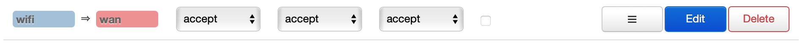
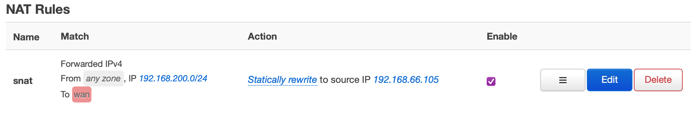

# The Insecure Proxy

This is a forward-proxy server that expects to run as a man-in-the-middle, i.e.
not as a configured HTTP Proxy in your web browser.

## Installation & Usage

E.Z. setup:

```
docker build -t the-insecure-proxy .
docker run --rm -p 3080:3080 the-insecure-proxy
```

The proxy will start on port 3080. To use another port change the `-p 3080:3080`
to `-p your_port_here:3080`.

To check it's working, do `curl -H 'Host: www.google.com'
http://127.0.0.1:3080/` - you should get some HTML back.

## Network Setup

To set this up locally, I added a second router to my network running OpenWRT.
The WAN port of the router was connect to the LAN with the proxy running, and
the wi-fi interface was set up as a separate network with the router acting as a
DHCP server. The following setup was performed on the OpenWRT router:


On the "General Settings" tab of the firewall, in the Zones table, the wifi zone
was allowed to forward traffic to the WAN zone. You could enable Masquerading
here to avoid the next step, I think. Also I think you probably want Input set
to reject or drop, but at time of writing I'm still experimenting.


On the NAT rules page, an SNAT rule was added which rewrites source addresses from
the wi-fi subnet (192.168.200.0/24) to the router's IP on the network.

Finally, to redirect all traffic from the wi-fi network to the proxy, the
following two rules were added to the Custom Rules page, where 192.168.67.205 is
the IP address of the proxy server, which runs on port 3080

```console
iptables -t nat -A PREROUTING -i wlan1 -p tcp -d 192.168.67.205 -j ACCEPT
iptables -t nat -A PREROUTING -i wlan1 -p tcp -j DNAT --to-destination 192.168.67.205:3080
```

The first rule immediately accepts traffic bound for 192.168.67.205. The only
port open on this IP will be 3080, so this is fine in my set-up.
If you run any other services on this IP (SSH, for example) - you will probably
want to add rules in the Traffic Rules page allowing traffic from the wi-fi
subnet to reach port 3080 on the proxy, but preventing any other ports from
being accessed.

The second rule is the one which rewrites all TCP traffic bound for any other IP
to be bound for the proxy server.
